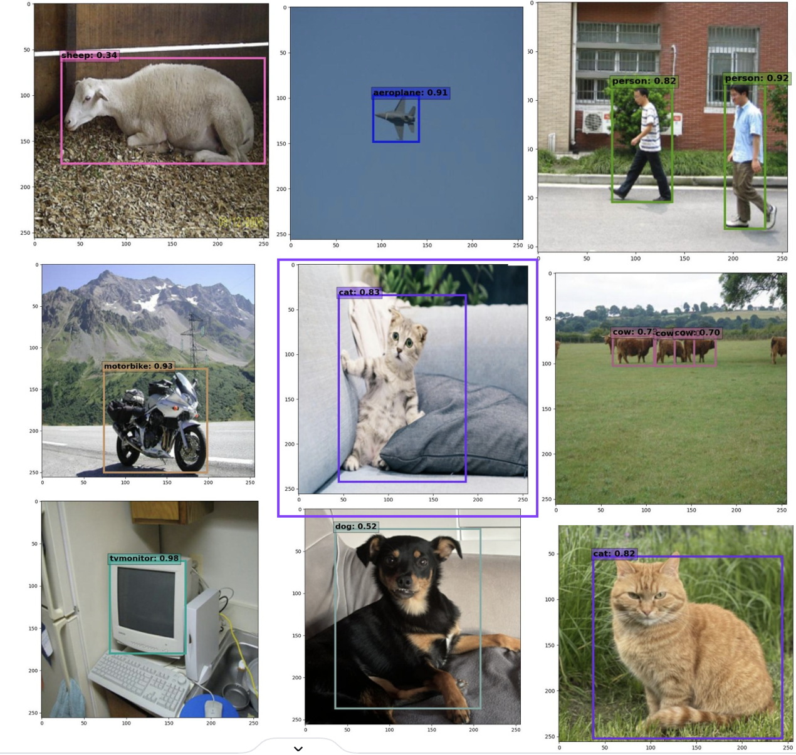
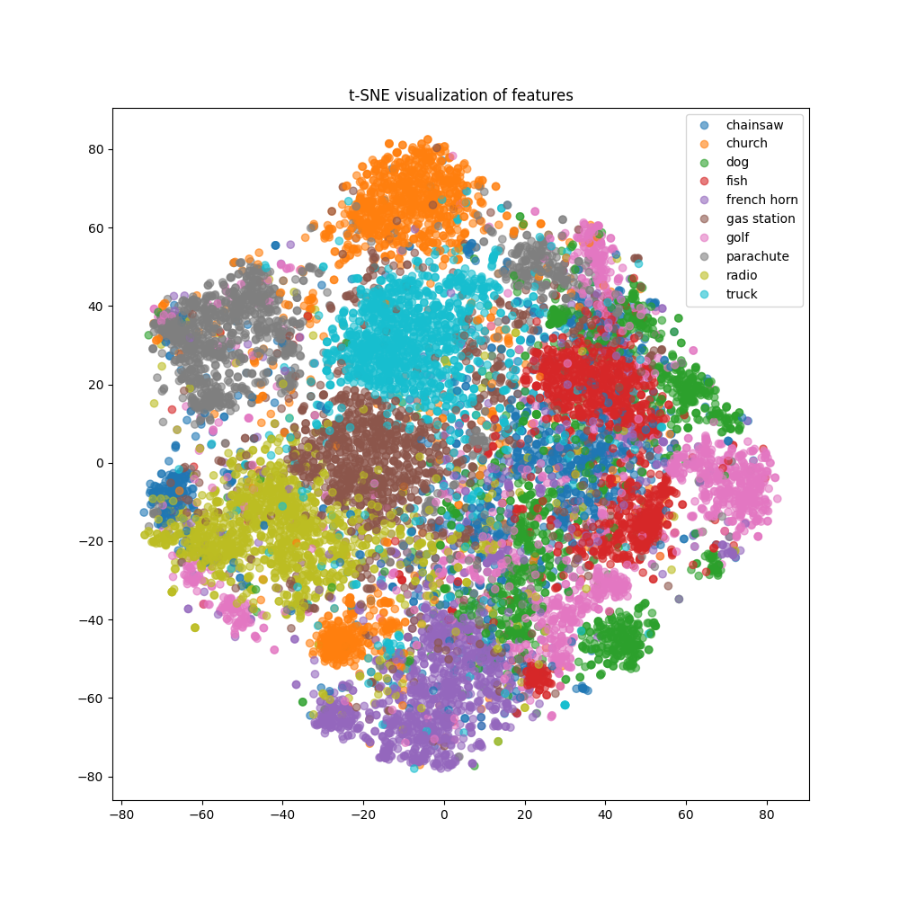
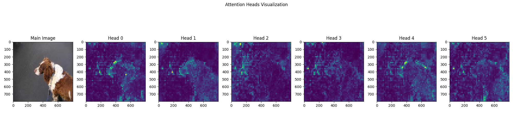
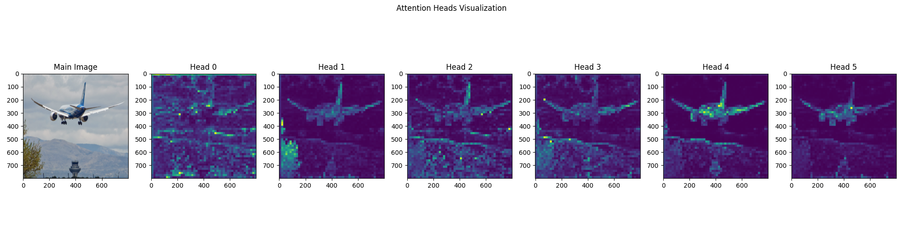
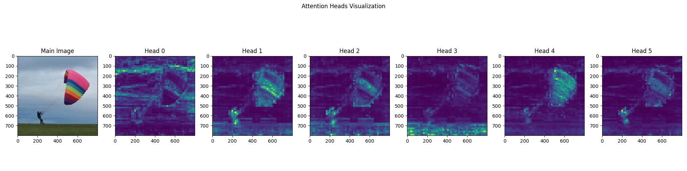
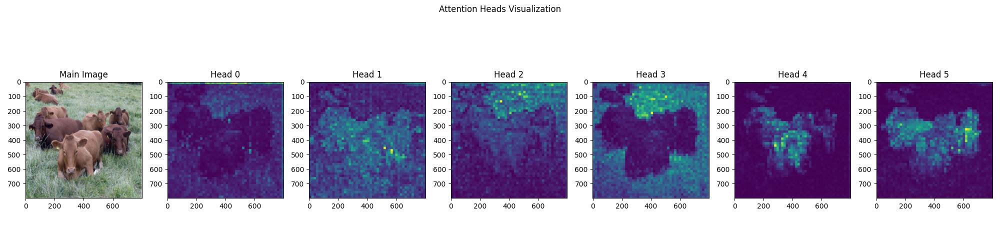
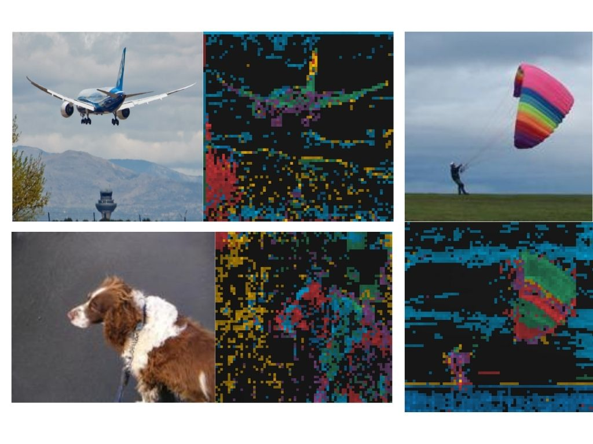

# DoRA_ICLR24
This repo contains the official implementation of ICLR 2024 paper "Is ImageNet worth 1 video? Learning strong image encoders from 1 long unlabelled video" 


[[`arXiv`](https://arxiv.org/abs/2310.08584)], [[`paper`](https://openreview.net/forum?id=Yen1lGns2o)], [[`dataset`](https://uvaauas.figshare.com/articles/dataset/Dora_WalkingTours_Dataset_ICLR_2024_/25189275)], [[`Project Page`](https://shashankvkt.github.io/dora)]


## Overview
### Motivation
Our goal is to build robust representations by leveraging the rich information in video frames. Standard SSL frameworks such as SimCLR, DINo etc. often assume correspondences between different views. This is true whether using dense or global representations by pooling e.g. iBOT. While it is relatively straightforward to establish correspondences in images, it becomes more challenging when dealing with temporal deformations, requiring some form of object tracking. In videos with a large field of view or ego-motion, obtaining correspondences becomes even more difficult.  


<div align="center">
  
</div>


## High-level idea 

We introduce DoRA, based on multi-object Discovery and tRAcking. It leverages the attention from the [CLS] token of distinct heads in a vision transformer to identify and consistently track multiple objects within a given frame across temporal sequences. On these, a teacher-student distillation loss is then applied. 
Importantly, we do not use any off-the-shelf object tracker or optical flow network. This keeps our pipeline simple and does not require any additional data or training. It also ensures that the learned representation is robust.

## Dataset Preparation

<div align="center">
  
</div>


### Original videos

The complete list of WTour videos are available in [HuggingFace Dataset](https://huggingface.co/datasets/shawshankvkt/Walking_Tours), comprising the YouTube links the detailed instructions on how to download it using necessary scripts.  

In case, the links are broken, you can download the videos directly from [Walking Tour Dataset](https://uvaauas.figshare.com/articles/dataset/Dora_WalkingTours_Dataset_ICLR_2024_/25189275)

### Face-blurred videos  

In order to comply with [GDPR](https://gdpr.eu/what-is-gdpr/), we also try to blur out all faces and license plates appearing in the video using [Deface](https://github.com/ORB-HD/deface)  

To do this for all videos in WTour dataset:
```
python3 -m pip install deface
```
Then run Deface on all videos using the bash script:
```
chmod a+x gdpr_blur_faces.sh  
./gdpr_blur_faces.sh
```

## Training DoRA

### Installing Packages

The requirements are easily installed via Anaconda. Here we create a conda environment called dora and install all the necessary libraries  

```
conda create -n dora python=3.8.2
conda activate dora
conda install pytorch==1.13.1 torchvision==0.14.1 torchaudio==0.13.1 pytorch-cuda=11.7 -c pytorch -c nvidia
pip install -r requirements.txt
```

### Pretraining DoRA

If you are using V100 GPUs with 32GB RAM, we recommend using the following script to pretrain DoRA: 

```
python -m torch.distributed.launch --nproc_per_node=8 main.py --arch vit_small --data_path /path-to-video/venice.mp4 \
  --output_dir /path-to-checkpoint/weights_WTours/DoRA/venice_8frames/ --optimizer adamw \
  --use_bn_in_head False --out_dim 65536 --batch_size_per_gpu 6 --local_crops_number 6 --epochs 100  \
  --num_workers 10 --lr 0.0005 --min_lr 0.00001  --norm_last_layer False  \
  --warmup_teacher_temp_epochs 30 --weight_decay 0.04 --weight_decay_end 0.4 \
  --frame_per_clip 8 --step_between_clips 60
```

For A100 GPUs with 80GB RAM, we recommend using the following pretraining script (only difference is in batch_size_per_gpu):

```
python -m torch.distributed.launch --nproc_per_node=8 main.py --arch vit_small --data_path /path-to-video/venice.mp4 \
  --output_dir /path-to-checkpoint/weights_WTours/DoRA/venice_8frames/ --optimizer adamw \
  --use_bn_in_head False --out_dim 65536 --batch_size_per_gpu 16 --local_crops_number 6 --epochs 100  \
  --num_workers 10 --lr 0.0005 --min_lr 0.00001  --norm_last_layer False  \
  --warmup_teacher_temp_epochs 30 --weight_decay 0.04 --weight_decay_end 0.4 \
  --frame_per_clip 8 --step_between_clips 60
```


## Pretrained models
You can download the weights of the pretrained backbone used for downstream tasks. All backbones are `ViT-S/16` models.


<table>
  <tr>
    <th>Epochs</th>
    <th>Model</th>
    <th>Pretrained Dataset</th>
    <th colspan="5">Download</th>
  </tr>
  <tr>
    <td>100</td>
    <th>DINO</th>
    <th>WT-Venice</th>
    <td><a href="https://drive.google.com/file/d/15YuTs6ulBa3yDuZdkF3azksRAdbOYahh/view?usp=sharing">backbone</a></td>
  </tr>
  <tr>
    <td>100</td>
    <th>DoRA</th>
    <th>WT-Venice</th>
    <td><a href="https://drive.google.com/file/d/1lkgfwyWWpzG0jKbn8h3zNhZJYxJOjqnN/view?usp=sharing">backbone</a></td>
  </tr>
  <tr>
    <td>300</td>
    <th>DoRA</th>
    <th>WT-Venice</th>
    <td><a href="https://drive.google.com/file/d/1wo90aVHcIBVvkkI3hDDf--Hz7aCNCqg2/view?usp=sharing">backbone</a></td>
   </tr>
  <tr>
    <td>100</td>
    <th>DoRA</th>
    <th>WT-all</th>
    <td><a href="https://drive.google.com/file/d/1SaULsFamQxYpkXHKk1V4IkOeCun-phhX/view?usp=sharing">backbone</a></td>
   </tr>
</table>


## Evaluation

### Linear Probing and KNN

For Linear probing on ImageNet-1K

```
python -m torch.distributed.launch --nproc_per_node=4 eval_linear.py \
--batch_size_per_gpu 512 --n_last_blocks 4 --avgpool_patchtokens 0 --arch vit_small --lr 0.01  \
--pretrained_weights /path-to-checkpoint/venice/checkpoint.pth --data_path /dataset/imagenet/ \
--output_dir /path-to-output-dir/venice/LP/
```

For KNN evaluation on ImageNet-1K

```
python3 -m torch.distributed.launch --nproc_per_node=4 eval_knn.py \
--arch vit_small --checkpoint_key teacher --data_path /dataset/imagenet/ \
--pretrained_weights /path-to-checkpoint/venice/checkpoint.pth
```

### Evaluation results for KNN and Linear classification on 10 classes of ImageNet (9469 train and 3925 validation images)

#### Linear classification

```
Evaluations on the validation set of Tiny ImageNet:

Linear Classifier trained 10 epoch:
Acc@1 88.204 Acc@5 99.389
```

#### KNN evaluation

```
Evaluations on the validation set of Tiny ImageNet:

10-NN classifier result: Top1: 82.36942675159236, Top5: 97.47770700636943
20-NN classifier result: Top1: 82.70063694267516, Top5: 98.03821656050955
100-NN classifier result: Top1: 81.35031847133757, Top5: 98.62420382165605
200-NN classifier result: Top1: 80.43312101910828, Top5: 98.54777070063695
```

### Semantic Segmentation (ADE20K) and Object Detection (MS-COCO)

Please follow the evaluation scripts from [iBOT](https://github.com/bytedance/ibot)


### Video Object Segmentation (DAVIS) and Object Tracking (GOT-10K)

(todo)

## CITATION

If you find this repository useful, please consider giving a star ⭐ and citation:

```
@inproceedings{venkataramanan2024imagenet,  
  title={Is ImageNet worth 1 video? Learning strong image encoders from 1 long unlabelled video},  
  author={Venkataramanan, Shashanka and Rizve, Mamshad Nayeem and Carreira, Jo{\~a}o and Asano, Yuki M and Avrithis, Yannis},  
  booktitle={International Conference on Learning Representations},  
  year={2024}  
}
```

---

## Object Detection Downstream Task with Pascal VOC Dataset

### Explanation
Pretraining self-supervised models has become a powerful approach for improving performance on downstream tasks, such as object detection. By leveraging large amounts of unlabelled data, self-supervised learning methods can learn robust and generalizable features, which can be transferred to specific tasks with limited labelled data. This process not only reduces the need for extensive manual annotation but also enhances the model's ability to generalize to new and diverse datasets.

### Benefits of Self-Supervised Learning
1. **Data Efficiency**: Self-supervised learning utilizes vast amounts of unlabelled data, which is easier to obtain compared to labelled data.
2. **Feature Learning**: It enables models to learn rich and diverse features that are transferable to various downstream tasks.
3. **Reduced Annotation Costs**: By minimizing the reliance on labelled data, it significantly cuts down the cost and effort involved in data annotation.
4. **Improved Generalization**: Models pretrained in a self-supervised manner often exhibit better generalization to new and unseen data.

### Implementation Details
In this task, self-supervised vision transformer (ViT) model as the backbone for object detection task is used. The backbone is pretrained using a DoRA method, which provides a strong foundation of learned features. Then the entire architecture using Faster RCNN, a popular object detection model, on the Pascal VOC dataset was fine-tuned.

**Steps:**
1. **Pretraining the Backbone**: 
   - Self-supervised ViT DoRA model pretrained on Walking Tour videos to use it as backbone for the object detection model was downloaded. 
2. **Object Detection Model**:
   - The pretrained ViT model serves as the backbone for the Faster RCNN object detection framework.
   - Faster RCNN is then fine-tuned on the Pascal VOC dataset, allowing it to learn the specifics of object detection with the robust features provided by the ViT backbone.

The entire architecture, including both the backbone and the object detection head, is fine-tuned to ensure optimal performance on the object detection task.

### Useful Resources
- **Vision Transformer Backbone**:
  The paper by Li et al. (2022) was instrumental in developing the ViT backbone. The insights from ["Exploring Plain Vision Transformer Backbones for Object Detection"](https://arxiv.org/pdf/2203.16527) (arXiv preprint arXiv:2203.16527) were particularly valuable.
- **Detectron2**:
  [Detectron2's codebase](https://github.com/facebookresearch/detectron2) was extremely helpful in implementing the Faster RCNN model and fine-tuning the entire architecture for object detection.

### How to run?
[You can download the weights of the pretrained object detection model with ViT bacbone here](https://drive.google.com/file/d/1pAwTVPSWF-HID1uLz1j2N9HotWiJ4Xl-/view?usp=drive_link).

```
cd eval/object_detection
```

#### Train Object Detection Model

```
python -m torch.distributed.launch eval_object_detect.py \
--batch_size_per_gpu 4 --data_path "../../dataset/pascal"  \
--output_dir "../../output/all/detection"
```

#### Inference on Images
```
python inference.py \
--image_input_path 'input/images/cat.jpg' --image_output_path 'output/images/cat.jpg'
```

#### Inference on Videos
```
python inference_video.py \
--video_input_path 'input/videos/venice.mp4' --video_output_path 'output/videos/venice.mp4'
```

#### Evaluation on the Validation Dataset
```
python evaluation.py \
--data_path "../../dataset/pascal"  \
--output_dir "../../output/all/detection"
```

### Example Results:

**Images:**



**Video:**


## Track Objects

The DoRA method leverages the attention from the [CLS] token of distinct heads in a vision transformer to identify and consistently track multiple objects within a given frame across temporal sequences. The vision transformer model uses multiple attention heads to focus on different parts of the input image. Each head attends to different features or objects within the frame.

### How to run?

```
cd eval/object_tracking
```

#### Visualization of Multi-Object Masks on the Top of Frames
```
python track_objects.py \
--input_video "input/venice.mp4"  \
--output_video "output/venice.mp4"
```

#### Visualization of Attention Heads on the Top of Frames
```
python attention_video.py \
--input_video "input/4.mp4"  \
--output_video "output/4.mp4"
```
### Example Results:

**Multi-Object Masks on the Top of Frames**


**Attention Heads on the Top of Frames:**


## t-SNE visualization of the features from a smaller subset of ImageNet with 10 classes

To illustrate the effectiveness of DoRA self-supervised learning approach, t-SNE was used to visualize the features from a smaller subset of ImageNet with 10 classes.



### How to run?

First, download the small subset of ImageNet dataset with 10 classes from [this link](https://github.com/fastai/imagenette).

```
cd eval/visualize_features
```

```
python3 -m torch.distributed.launch visualize_embeddings.py \
--data_path ../../dataset/imagenet/ \
--checkpoint ../../model/venice/checkpoint.pth
```

## Visualizing attention maps for various heads in some images

Attention maps provide insights into which parts of the image the model focuses on.

### How to run?

```
cd eval/visualize_attention
```

```
python visualize_attention.py \
--output_dir attention_data/attn-results/ \
--checkpoint ../../model/venice/checkpoint.pth \
--image_path attention_data/parachute.JPEG \
--threshold 0.5
```

###  Self-attention map from each map









### Self-attention map from multiple heads are visualized with different color


